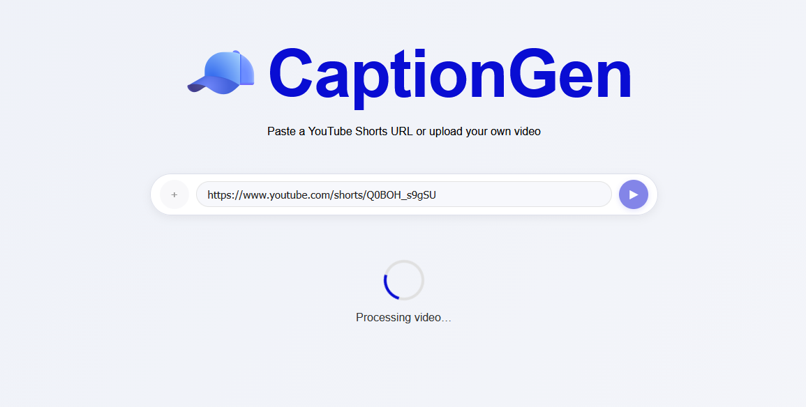

# 🧢 CaptionGen

**AI-powered, auto-synced captions for YouTube Shorts.**
Removes the manual captioning pain — built on **FastAPI + Whisper + FFmpeg** for real-time caption generation.


---

## ⚙️ Features

* ⚡ **Direct YouTube Shorts support** – paste any link, get captioned video
* 🧠 **OpenAI Whisper** – accurate transcription with natural pacing
* 🪶 **Micro-captions (2–3 words)** – timed for natural rhythm
* 🧹 **Auto cleanup** – punctuation normalization and overlap fixes
* 🎨 **Styled burn-in captions** – crisp white text with dynamic highlights
* 🧭 **Face-aware positioning** – captions adapt to visual composition

---

## 🚀 Local Development

### 1. Clone the repo

```bash
git clone https://github.com/<your-username>/CaptionGen.git
cd CaptionGen
```

### 2. Create and activate a virtual environment

```bash
python3 -m venv .venv
source .venv/bin/activate  # (Windows: .venv\Scripts\activate)
```

### 3. Install dependencies

```bash
pip install -r requirements.txt
```

### 4. Run the FastAPI server

```bash
cd api
uvicorn index:app --host 0.0.0.0 --port 8000 --reload
```

Then open your browser at:

```
http://127.0.0.1:8000
```

---

## 🧩 Example Workflow

| Step | Action                           | Output                                 |
| ---- | -------------------------------- | -------------------------------------- |
| 1    | Paste a YouTube Shorts URL       | Video fetched automatically            |
| 2    | Whisper transcribes + timestamps | Clean `.srt` generated                 |
| 3    | FFmpeg burns captions            | `outputs/videos/<title>_captioned.mp4` |
| 4    | View & download in browser       | Cinematic captions, ready to post      |

---

## 🧱 Stack

* **FastAPI** — backend + static serving
* **Whisper (OpenAI)** — transcription engine
* **FFmpeg** — caption rendering
* **yt-dlp** — YouTube fetcher
* **pysrt** — SRT generation and formatting

---

## 🧭 Next Version

* Vision-based caption placement (CLIP / VideoLLaMA)
* Real-time upload preview
* Custom caption templates per brand

---

## ⚖️ License

This project is licensed under the **[MIT License](./LICENSE)**.
You are free to use, modify, and distribute it with attribution.

